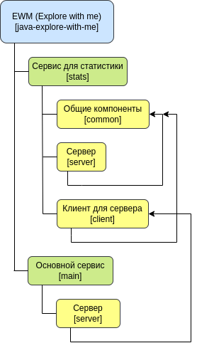

# Explore with me

> Explore with me - это проект, который позволяет пользователям
> находить интересные события, а также компанию для их посещения.
> Основная идея заключается в упрощении процесса планирования досуга
> и облегчении поиска единомышленников.

## Оглавление

- [Архитектура проекта](#архитектура-проекта)
- [Инструкция по установке](#инструкция-по-установке)
- [Технологический стек](#технологический-стек)

## Архитектура проекта


## Инструкция по установке

- [Требования](#требования)
- [Установка](#установка)
- [Запуск](#запуск)

### Требования

- Git
- Docker
- JDK 11 или выше
- Apache Maven 3.6.0 или выше

### Установка

1. Склонируйте репозиторий на свой компьютер с помощью команды:
```bash
git clone https://github.com/Klementor/java-explore-with-me.git
```

2. Перейдите в директорию проекта:
```bash
cd java-explore-with-me
```

3. Соберите проект с помощью Apache Maven:
```bash
mvn clean install
```

### Запуск
После установки проекта, вы можете запустить его с помощью команды:
```bash
sudo docker-compose up -d
```

## Технологический стек

- Java 11
- Spring Boot 2
- ORM: Hibernate, Spring Data JPA
- Apache Maven
- Docker: dockerfile, docker-compose